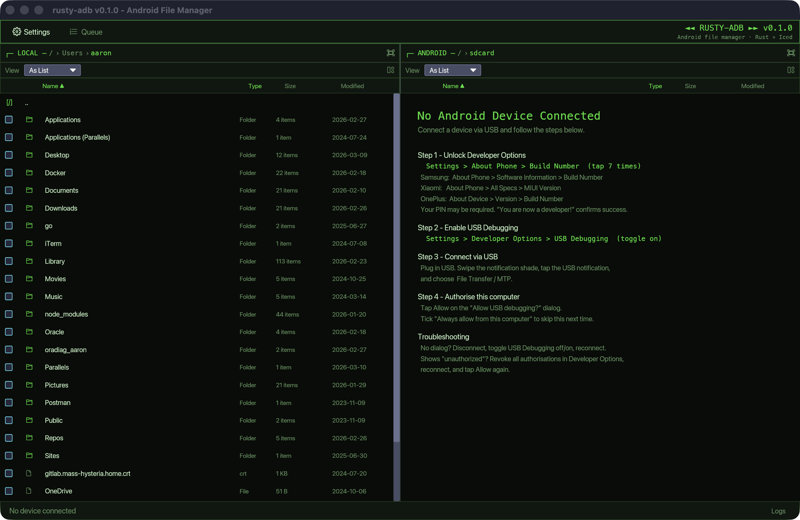

# rusty-adb

A native Android file manager for the desktop, built with Rust and [Iced](https://iced.rs).

Browse your Android device's file system, transfer files in both directions, preview images and text, and manage files — all without leaving your terminal workflow.


---

## Screenshot



> *Screenshot placeholder — image will appear here once the app is running.*

---

## Features

| Feature | Description |
|---|---|
| **Device browser** | Two-pane layout: local filesystem on the left, Android device on the right |
| **Device auto-detection** | Polls `adb devices` every 2 s; connects automatically when a device is authorised |
| **File transfers** | Copy files to/from Android with a live progress bar and transfer speed display |
| **Drag-and-drop** | Drop files from Finder/Explorer onto the app to push them to the current Android directory |
| **Multi-file selection** | Select multiple files in the Android pane and transfer them all in one queued batch |
| **File preview** | Preview images (PNG, JPG, GIF, WebP, BMP) and text files directly in the app |
| **Rename & delete** | Rename or delete files on the Android device with confirmation prompts |
| **Settings** | Configure log level, console logging, and file logging via a persistent `config.yml` |
| **About dialog** | App version, GitHub link, and license info |
| **Coloured status bar** | Connection state (disconnected / unauthorized / connected) and live transfer progress |

---

## Prerequisites

### Rust

Install via [rustup](https://rustup.rs):

```bash
curl --proto '=https' --tlsv1.2 -sSf https://sh.rustup.rs | sh
```

Minimum supported Rust version: **stable** (1.75+).

### ADB (Android Debug Bridge)

**macOS — Homebrew (recommended):**
```bash
brew install --cask android-platform-tools
```

**macOS — Android Studio:**
The `adb` binary is installed with Android Studio at:
```
~/Library/Android/sdk/platform-tools/adb
```
rusty-adb checks this path automatically if `adb` is not on your `$PATH`.

**Linux:**
```bash
# Debian/Ubuntu
sudo apt install android-tools-adb

# Arch
sudo pacman -S android-tools
```

**Windows:** Download [Platform Tools](https://developer.android.com/tools/releases/platform-tools) and add the folder to your `PATH`.

### Android Device Setup

1. On your Android phone, go to **Settings → About phone** and tap **Build number** 7 times to enable Developer Options.
2. Go to **Settings → Developer options** and enable **USB Debugging**.
3. Connect the phone with a USB cable.
4. When prompted on the phone, tap **Allow** to authorise your computer.

---

## Build & Run

### Quick start

```bash
git clone https://github.com/aaroncontini/rusty-adb.git
cd rusty-adb

# Run in development mode
./scripts/dev.sh

# Or build a release binary
./scripts/build.sh
./target/release/rusty-adb
```

### Manual cargo commands

```bash
# Development build + run
cargo run --package rusty-adb

# Release build
cargo build --release
./target/release/rusty-adb

# Run all tests
cargo test --all

# Lint
cargo clippy --all-targets -- -D warnings
```

### Install to ~/bin or /usr/local/bin

```bash
./scripts/install.sh
# or with a custom prefix:
./scripts/install.sh --prefix ~/.local/bin
```

---

## Developer Scripts

The `scripts/` directory provides richly-formatted helper scripts for common tasks:

| Script | Purpose |
|---|---|
| `scripts/build.sh` | Release build (`--debug` for a debug binary) |
| `scripts/test.sh` | Full quality gate: tests → clippy → fmt |
| `scripts/dev.sh` | Run with auto-reload via `cargo-watch` (falls back to `cargo run`) |
| `scripts/install.sh` | Build and install the release binary |
| `scripts/check-deps.sh` | Prerequisite checker (sourced by all other scripts) |

All scripts accept `--help`.

---

## Keyboard Shortcuts

| Key | Action |
|---|---|
| `F5` | Refresh both panes |
| `F2` | Rename selected Android file |
| `Backspace` | Navigate up in the local pane |
| `Escape` | Close modal (preview → about → settings → clear error) |

---

## Configuration

rusty-adb reads `~/.rusty-adb/config.yml` on startup. All fields are optional and fall back to sensible defaults.

```yaml
log:
  level: info              # trace | debug | info | warn | error
  console_enabled: true    # write log output to stderr
  file_enabled: true       # write rotating log files to ~/.rusty-adb/
```

Log files are written to `~/.rusty-adb/` and rotate automatically.

---

## Project Layout

```
rusty-adb/
├── rusty-adb/          # Main application crate
│   ├── src/
│   │   ├── main.rs     # Iced Application, Message enum, update/view
│   │   ├── adb.rs      # AdbClient — device polling, file operations
│   │   ├── transfer.rs # Async file transfer engine with progress events
│   │   ├── config.rs   # AppConfig loaded from config.yml
│   │   ├── local_pane.rs     # Local filesystem pane widget
│   │   ├── android_pane.rs   # Android device pane widget
│   │   ├── status_bar.rs     # Status bar widget
│   │   ├── theme.rs          # Colour palette
│   │   └── lib.rs            # Library target for integration tests
│   └── tests/
│       ├── adb_integration.rs  # Integration tests via mock-adb
│       └── fixtures/mock-adb   # Bash script that fakes the adb binary
├── rusty-logging/      # Shared logging crate
├── scripts/            # Developer helper scripts
└── docs/               # Architecture docs and screenshots
```

---

## Contributing

See [CONTRIBUTING.md](CONTRIBUTING.md) for dev setup, coding conventions, the test strategy (unit tests + mock-adb integration tests), and the PR checklist.

For a deeper look at the architecture, see [docs/ARCHITECTURE.md](docs/ARCHITECTURE.md).

---

## License

MIT — see [LICENSE](LICENSE).
